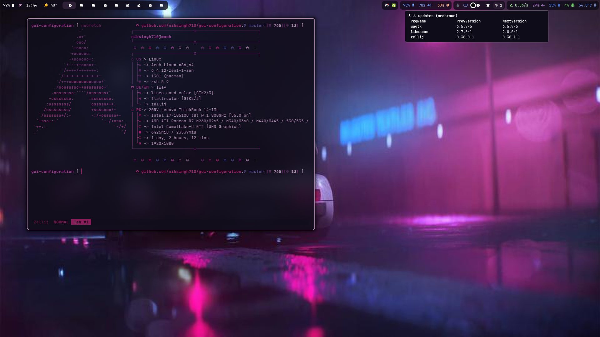

# GUI Config

[](LICENSE)
[](https://github.com/niksingh710/gui-configuration/stargazers)
[](https://github.com/niksingh710/gui-configuration/network/members)
[](https://github.com/niksingh710/gui-configuration)
[](https://github.com/niksingh710/gui-configuration/commits/master)
[](https://github.com/niksingh710/gui-configuration/issues)
[](https://github.com/niksingh710/gui-configuration/pulls)

This is my Arch Linux GUI Config and Scripts.
I use [rofi](https://github.com/lbonn/rofi) as my application launcher, and [Hyprland](https://github.com/hyprwm/hyprland) as my window manager.

# Installation

```
yay -S --needed \
    rofimoji rofi-calc rofi-bluetooth-git android-file-transfer-linux-git \
    nemo wpgtk zathura zathura-pdf-mupdf pm-utils \
    brightnessctl pipewire pipewire-pulse wireplumber \
    networkmanager networkmanager-dmenu-git \
    xdg-desktop-portal-hyprland libnoitfy jq \
    rofi-lbonn-wayland-git waybar hyprland xstow swww
```

I hope didn't missed anything 🤔

# Install

```
git clone https://github.com/niksingh710/gui-configuration.git ~/.gui-dots
cd ~/.gui-dots
xstow */ -t ~
```

# Preview

### Desktop

With Hyprland,Waybar and foot terminal


### Rofi

I use rofi with waybar to interact with my waybar custom modules Like (cpu freq and notification)


### Rofi on Faded Color


### Firefox theme

I use firefox with tree like tab structure and firenvim and much more plugins


Make sure to add chrome folder to firefox from the extra/chrome
Make sure to have beta sideberry with it's css also in extra/chrome/sideberry.css add this in extension settings

# Note

#### Gammastep
It relies on geoclue2 for location.
it will only fetch the location if `/usr/lib/geoclue-2.0/demos/agent` is running in background
`gammastep -l geoclue2` will make the system turn on gamma based on location.
make sure to run `gammstep-indicator` for ui reference control

### Power system
install `pm-utils` that will expose `on_ac_power` and then you can use `waybar/bin/battersaver-toggle` to control power

### Wine & Lutris
[wine deps](https://github.com/lutris/docs/blob/master/WineDependencies.md)

xstow links to the parent dir (make sure to read help)
keep in mind to give the args `-t ~` no matter where you are cloning

# Waybar
`waybar/bin/start.sh` executes waybar and injects string in config so that only shown on one monitor.
make sure to modify to your needs

# MAYBE
if only using fzf.zsh or a single module and keymaps not working then you must be using `zsh-vi-mode`
check [this](https://github.com/jeffreytse/zsh-vi-mode#execute-extra-commands)


